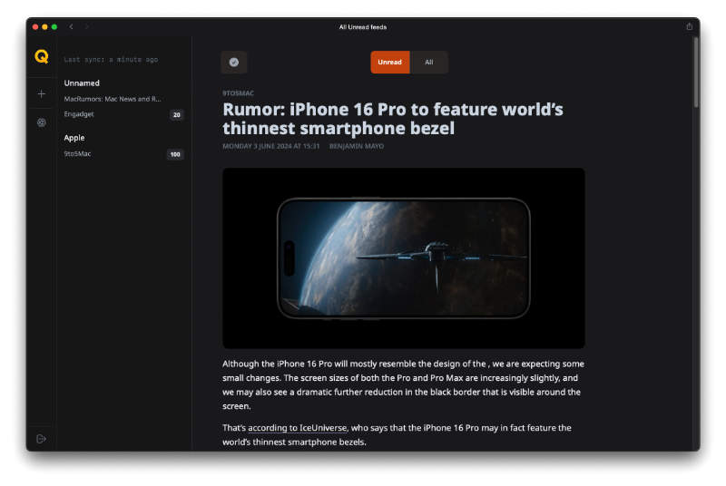
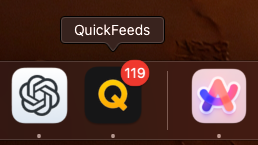
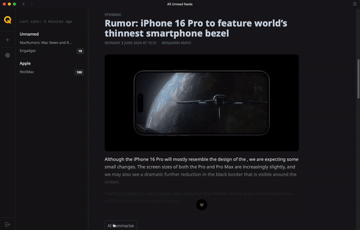

# QuickFeeds [](https://github.com/defnone/quickfeeds/actions/workflows/python-app.yml)
A simple self-hosted RSS reader with article summarization feature.

This is my first software project, developed for personal use.

It runs on:
- Flask
- SQLite
- Groq API (for article summarization)
- Google Translate (for translating summarized text)

The application interface works well as a [Safari web app](https://support.apple.com/en-kw/guide/safari/ibrw9e991864/mac) for both macOS and iOS.




On macOS, it supports badges for unread feeds. You need to approve the system notification request from the web app for the badges to start displaying.



To activate summarization, you need to obtain a Groq API key and add it in the settings.



Any article text is first summarized through Groq using the llama3 model, which is free within the limits for personal use. Currently, the summarization translation supports the following languages through Google Translate:

- Russian: "ru"
- English: "en"
- German: "de"
- French: "fr"
- Spanish: "es"
- Italian: "it"
- Chinese: "zh-CN"
- Japanese: "ja"
- Korean: "ko"

I'm not sure how well this works for most languages.

## Getting Started

To get started with QuickFeeds, follow these steps to download the `docker-compose.yml` file and run the application.

### Prerequisites

Ensure you have Docker and Docker Compose installed on your machine. You can download and install them from the official Docker website: [Docker](https://www.docker.com/)

### Installation

#### Option 1: Using Docker Compose

1. **Download the `docker-compose.yml` file**

   Open your terminal and run the following command to download the `docker-compose.yml` file from the repository:

   ```bash
   curl -O https://raw.githubusercontent.com/defnone/quickfeeds/main/docker-compose.yml
   ```

2. **Run the application**

   Once the `docker-compose.yml` file is downloaded, you can start the application with the following command:

   ```bash
   docker-compose up -d
   ```

   This command will start the application in detached mode, running it in the background.

#### Option 2: Quick Launch Using Docker Run

If you prefer to quickly launch the application without using `docker-compose`, you can use the following `docker run` command:

```bash
docker run -d \
  --name flask_app \
  -p 8000:8000 \
  -v quickfeeds_data:/data \
  -e FLASK_APP=run.py \
  -e FLASK_RUN_HOST=0.0.0.0 \
  -e FLASK_RUN_PORT=8000 \
  -e LOG_LEVEL=INFO \
  ghcr.io/defnone/quickfeeds:latest
```

Now you can access the interface at http://your-ip:8000 and create an account. Please ensure that the application is not accessible online for security reasons.

### Updating the Application

To update the application to the latest version, follow these steps:

1. **Pull the latest version of the Docker images**

   Update the Docker images by pulling the latest version from the repository:

   ```bash
   docker-compose pull
   ```

2. **Recreate the containers**

   After pulling the latest images, recreate the containers to apply the updates:

   ```bash
   docker-compose up -d --force-recreate
   ```

### Stopping the Application

If you need to stop the application, you can do so with the following command:

```bash
docker-compose down
```

This will stop and remove all the containers defined in the `docker-compose.yml` file.

## Password Change

The password is stored in encrypted form in the database. To change it, you need to run the following command on the Docker host: `docker exec quickfeeds-flask_app-1 python change_password.py user_name new_password`. Here, `quickfeeds-flask_app-1` is the name of the container, which can be seen by running the command `docker ps`.

Special thanks to OpenAI.
